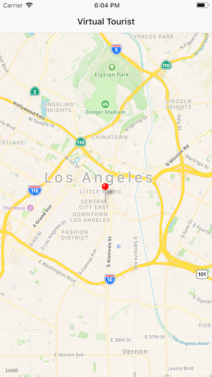
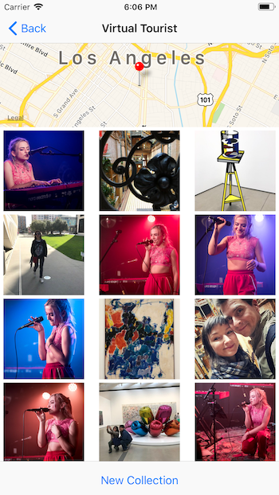

# VirtualTourist

## Description
Users can drop a pin on the map, and view photos from that location, provided by Flickr's public API.  Utilizes CoreData to persist photos on device, UIKit, MapKit, UICollectionView, Fetch Requests.

 

## Usage
* No pre-work needed.  Just build and run (use Master branch).
* Upon launch, long press a location on the map to drop a pin.
* Tap a pin to see photos from that location, accessed via a [FLICKR api](https://www.flickr.com/services/api/).
* In the photo collection view, tap a photo to delete it from the collection, or press "New Collection" button to load a new set of photos from the location.
